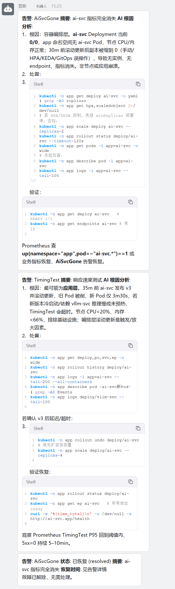
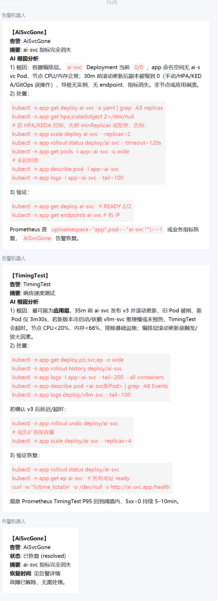
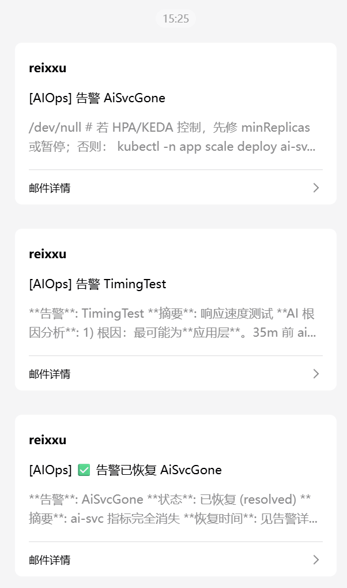

# AI 智能分析 K8s 集群服务日志和告警
# AI-Powered Log & Alert Analysis for K8s Services

> 基于 3 节点 Kubernetes 集群 + Harbor 私有仓库，从零搭建的
> **日志采集 → 指标监控 → 告警 → AI 辅助分析 → 多渠道通知** 完整链路实操项目。

---

## 📸 效果展示

**故障注入后，钉钉 / 企业微信 / 邮箱会同时收到「告警内容 + AI 根因分析」；故障恢复时收到「已恢复」通知。**

| 钉钉 | 企业微信 | 邮箱 |
|------|---------|------|
|  |  |  |

> 截图内容（AI 自动生成的分析）：
> 1. **根因**：ai-svc Deployment 被缩容至 0 副本（事件显示先缩到 0、25 分钟前扩到 2、2 分钟前又删除全部 Pod），导致无 Pod 暴露 /metrics，Prometheus 抓取目标消失。**无证据表明节点或底层故障。**
> 2. **处置**：`kubectl -n app get deploy ai-svc -o yaml | grep replicas` 确认副本数与触发源；`kubectl -n app scale deploy ai-svc --replicas=2` 恢复；检查 Pod 是否 Running/Ready。
> 3. **验证**：Pod 2/2 Running、Endpoints 有 Pod IP、/metrics 返回 200、告警自动解除。

**完整链路**：

```
故障注入 → Prometheus 规则触发 → Alertmanager 路由 → AIOps 助手
   ├─ 从 Prometheus 取指标（定位异常范围）
   ├─ 从 Loki 取故障时间窗日志（确认应用侧表现）
   └─ 用 kubectl 读 Pod 状态与事件（还原操作时序）
        ↓
   交大模型分析 → 钉钉 / 企业微信 / 邮箱（告警 + 根因 + 处置建议）
        ↓
   故障恢复 → resolved 通知（✅ 已恢复）
```

---

## 📌 一、项目技术亮点

- **云原生基建**：多节点 K8s 集群、NFS 动态存储供给、MetalLB 负载均衡、Ingress-NGINX 入口、Harbor 私有镜像仓库。
- **可观测体系**：Prometheus 指标采集（node-exporter / kube-state-metrics / 业务自定义指标）、Loki + Promtail 日志采集、Grafana 可视化、Alertmanager 告警路由。
- **告警工程**：PrometheusRule 规则设计（含 `absent()` 指标消失检测）、分组去重、分级路由、跨命名空间覆盖。
- **AI 辅助分析**：LLM 根因分析（按告警类型自动采集上下文）、RAG 知识库问答、多渠道通知与恢复通知。

## 🎯 二、业务场景

以集群内的 AI 推理服务（`ai-svc`）为被监控对象，验证一条完整的运维闭环：**服务出问题时，告警能自动触发，AI 能基于真实集群数据给出一份初步的根因分析与处置建议，并推送到值班渠道**，减少人工从零排查的时间。

> **关于 AI 部分的适用边界**（重要）：
> 在告警体系成熟的团队里，日常告警都有对应的处置手册（runbook），单条告警并不需要 AI 解读。本项目把 AI 定位为**辅助分析**，它更适合两类场景：
> 1. **告警风暴时的聚合降噪**——一次底层故障触发几十条关联告警，把告警与同时间窗的日志、事件压成一条根因结论；
> 2. **规则覆盖不到的故障**——告警规则是人写的，只能覆盖想到的情况；新故障模式或跨服务级联问题，需要基于全量数据反推根因。
>
> 因此 **LLM 不参与「要不要告警」的判定**，只负责「已确定的告警如何解释与处置」；确定性、可复现的判定仍然交给规则与统计。能用规则消除的噪音，不必花 LLM 解释。

---

## 📊 三、可观测平台

项目内置完整的可观测体系（可观测性三支柱），既是人工查看的监控平台，也是 AIOps 助手的数据来源：

| 支柱 | 组件 | 访问方式 | 状态 |
|------|------|---------|------|
| **指标 Metrics** | Prometheus（kube-prometheus-stack） | ClusterIP:9090 | ✅ 采集节点/容器/Pod/业务指标 |
| **可视化** | Grafana | `http://192.168.243.202`（LoadBalancer） | ✅ 看板可访问 |
| **日志 Logs** | Loki + Promtail（DaemonSet×3） | ClusterIP:3100 | ✅ `{namespace="app"}` 日志可查 |
| **告警 Alerts** | Alertmanager + PrometheusRule | ClusterIP:9093 | ✅ 告警规则 + 路由到 AIOps |

**关键数据流**：
```
业务 Pod 指标/日志
   │
   ▼
Prometheus（指标）← ServiceMonitor ← ai-svc /metrics
Loki（日志）← Promtail ← /var/log/pods/*
   │
   ▼
告警规则触发 → Alertmanager → AIOps 助手（AI 分析）
```

> 说明：**Prometheus 管指标（主动拉取），Promtail 管日志（推送）**，两者互不调用；
> 告警只由 Prometheus 指标驱动，日志不参与告警判定，仅作为 AI 根因分析的上下文。

---

## ✅ 四、实施进度追踪（每完成一步同步更新）

> 当前进度：**全链路已完成** —— 存储、网络、业务、可观测、告警、AI 分析、多渠道通知均已验证通过，详见下方清单。

| 阶段 | 步骤 | 状态 |
|------|------|------|
| **基础** | 环境确认：3 节点 K8s v1.36.3 已 Ready，Harbor 可登录 | ✅ 完成 |
| **基础** | 确定存储方案：采用 nfs-subdir-external-provisioner v4.0.2（NFS 动态供给，替代 local-path） | ✅ 完成 |
| **存储** | Harbor 机（192.168.243.120）部署 NFS 服务端 `/nfsdata/ai-cloud-native-ops` | ✅ 完成 |
| **存储** | 三台 k8s 节点安装 nfs-utils 客户端 | ✅ 完成 |
| **存储** | 部署 nfs-client-provisioner（Deployment+RBAC+StorageClass） | ✅ 完成 |
| **存储** | 验证动态供给：创建测试 PVC/Pod 确认挂载 | ✅ 完成 |
| **网络** | 部署 MetalLB（LoadBalancer） | ✅ 完成 |
| **网络** | 部署 Ingress-NGINX | ✅ 完成 |
| **基础** | 创建命名空间 app / monitoring / aiops | ✅ 完成 |
| **业务** | 构建并推送 ai-svc / mock-vllm 镜像到 Harbor | ✅ 完成 |
| **业务** | 部署业务服务 + Ingress，验证推理 API | ✅ 完成 |
| **可观测** | 部署 Prometheus / Grafana / Alertmanager / kube-state-metrics / node-exporter | ✅ 完成 |
| **可观测** | 业务指标采集打通（ServiceMonitor + ai-svc /metrics 修复） | ✅ 完成 |
| **可观测** | 部署 Loki（单体 + filesystem + NFS PVC） | ✅ 完成 |
| **可观测** | 部署 Promtail（日志采集 DaemonSet，双 job：kubernetes-pods + docker-containers） | ✅ 完成 |
| **可观测** | 配置告警规则 + Alertmanager → AIOps webhook | ✅ 完成 |
| **AIOps** | 部署 AIOps 助手（LLM + RAG + 上下文采集） | ✅ 完成 |
| **AIOps** | AI 日志智能分析验证通过（analyze-log：Loki 日志 → DeepSeek 分析） | ✅ 完成 |
| **演示** | 制造故障 → 告警 → AI 自动根因分析（AiSvcDown 告警 → AI 结合集群日志判断为瞬时抓取失败/误报） | ✅ 完成 |
| **演示** | **完整自动化闭环**：ai-svc 缩容 → AiSvcGone 告警（absent() 检测）→ Alertmanager 路由 → AIOps webhook 自动接收（200 OK） | ✅ 完成 |
| **通知** | **多渠道告警通知**：AI 分析结果 + 原始告警 → 钉钉 / 企业微信 / 邮件 三渠道推送（errcode:0 全部成功） | ✅ 完成 |
| **通知** | **故障恢复通知**：告警 resolved → 「✅ 告警已恢复」三渠道推送（事件生命周期完整闭环） | ✅ 完成 |
| **AIOps** | **AI 根因分析质量验证**：能读取集群事件（缩容记录）、精准定位根因（人工缩容导致）、给出处置步骤 | ✅ 完成 |
| **AIOps** | **集群级告警支持**：上下文按告警类型自动分流（节点/控制平面/业务），etcd 类告警可正确分析并给出层级判断 | ✅ 完成 |
| **收尾** | 文档完善、架构图 | 🔄 进行中 |

**变更日志（按时间）**
- `2026-08-26`：环境确认（3 节点 Ready + Harbor 登录成功）
- `2026-08-26`：存储方案由 local-path 改为 NFS（取自《7.Kubernetes存储.pdf》的 nfs-subdir-external-provisioner 方案，更企业级，支持 RWX）
- `2026-08-26`：确认 Harbor 镜像 `reix.harbor.cn/k8s/nfs-subdir-external-provisioner:v4.0.2` 可拉取
- `2026-08-26`：完成 NFS 服务端部署（Harbor 机 192.168.243.120，共享目录 `/nfsdata/ai-cloud-native-ops`）
- `2026-08-26`：部署 nfs-client-provisioner 成功（Pod Running，StorageClass `nfs-client` 设为默认）
- `2026-08-26`：动态供给验收通过：测试 PVC 自动 Bound、PV 自动创建、Pod 写入 NFS 成功
- `2026-08-26`：落盘验证通过：Harbor 机 `/nfsdata/ai-cloud-native-ops/default/test-nfs-claim/test.txt` 内容正确，数据穿透 K8s→NFS→宿主机磁盘全链路打通
- `2026-08-27`：部署 MetalLB v0.16.1 成功（controller + speaker×3 Running），IP 池 `192.168.243.200-220`，L2 通告 ens160；LoadBalancer 验证通过：test-lb-svc 拿到 `192.168.243.200` 并成功访问 nginx 页
- `2026-08-27`：部署 Ingress-NGINX v1.15.1 成功（镜像走 Harbor），controller Running，LoadBalancer 拿到 `192.168.243.201`
- `2026-08-27`：Ingress 端到端验证通过：`curl -H "Host: test.ops.local" http://192.168.243.201/` 返回 nginx 页，MetalLB→Ingress→Pod 全链路打通
- `2026-08-27`：业务镜像构建并推送成功：`reix.harbor.cn/k8s-ai/ai-svc:latest`、`mock-vllm:latest`（Harbor k8s-ai 私有项目，已配 imagePullSecret）
- `2026-08-27`：业务服务部署成功：ai-svc×2 + vllm-svc Running，LoadBalancer 拿到 `192.168.243.200`，推理 API `/v1/infer` 验证通过（延迟 ~50ms）
- `2026-08-27`：kube-prometheus-stack 部署成功（Helm）：Prometheus/Grafana/Alertmanager/kube-state-metrics/node-exporter 全部 Running，Grafana LoadBalancer 拿到 `192.168.243.202`
- `2026-08-27`：业务指标采集打通：修复 ai-svc `/metrics` JSON 包装 bug（改 Response 纯文本），ServiceMonitor + release 标签 + Service label 三层配置正确后，`ai_svc_requests_total` 成功被 Prometheus 采集
- `2026-08-27`：Loki（裸清单单体 + NFS PVC）部署成功；Promtail 排障完成（根因：容器日志软链指向 `/data/docker/containers` 未挂载，加挂载 + 双 job 配置后日志采集打通，`{namespace="app"}` 查询成功）
- `2026-08-28`：告警规则部署（5+1 条 PrometheusRule），修复「缩容=0 时 up==0 不触发」盲区（新增 `absent()` 检测的 AiSvcGone 规则）；Alertmanager 路由到 AIOps webhook（绕过 CRD namespace 限制，直接改 secret 配置）
- `2026-08-28`：AIOps 助手部署成功（DeepSeek LLM + RAG + ContextCollector），修复 Alertmanager webhook status 字段位置 bug、kubectl 进镜像、模型名大小写等问题
- `2026-08-28`：**完整自动化闭环验证**：ai-svc 缩容 → AiSvcGone 告警 → Alertmanager → AIOps 自动接收（200 OK）
- `2026-08-29`：**多渠道通知打通**：AI 分析结果 + 告警 → 钉钉 / 企业微信 / 邮件三渠道真实送达（errcode:0，用户终端截图确认）
- `2026-08-29`：**故障恢复通知打通**：告警 resolved → 「✅ 告警已恢复」三渠道推送，事件生命周期完整闭环
- `2026-09-12`：**支持集群级/非业务告警分析**：`context.py` 按告警类型自动分流上下文（节点类/控制平面类/业务类）；`main.py` 识别 `cluster-wide` 告警并要求 AI 给出层级判断（基础设施/编排/应用）
- `2026-09-12`：**修复推理模型空返回问题**：定位到 `deepseek-v4-flash` 的思考过程（reasoning_content）消耗 token 导致 `content` 为空；`llm.py` 将 max_tokens 提升至 4000（支持 `LLM_MAX_TOKENS` 调整）、增加 reasoning_content 回退与调用诊断日志
- `2026-09-12`：etcd 集群级告警分析验证通过（AI 正确识别「单节点 etcd 集群触发 HA 阈值告警」并给出 etcdctl 排查命令）

---

## 🖥️ 五、当前环境

| 角色 | 主机 | IP | OS | 规格 | 用途 |
|------|------|-----|-----|------|------|
| 控制平面 | k8s-master | 192.168.243.121 | Rocky Linux 10.2 | 4C/4G/50G | 集群管理 |
| 工作节点 | k8s-node1 | 192.168.243.122 | Rocky Linux 10.2 | 4C/4G/50G | 业务/监控 |
| 工作节点 | k8s-node2 | 192.168.243.123 | Rocky Linux 10.2 | 4C/4G/50G | 业务/AIOps |
| Harbor+NFS | harbor | 192.168.243.120 | Rocky Linux 10.2 | — | 镜像仓库 + NFS 存储 |

**集群状态**：Kubernetes v1.36.3，容器运行时 docker 29.6.2，3 节点 Ready。

---

## 🏗️ 六、架构图

```
                        ┌──────────────────────────────┐
                        │       客户端 / Web UI          │
                        └──────────┬───────────────────┘
                                   │ (https/ingress)
               ┌───────────────────▼───────────────────┐
               │       Ingress-NGINX / MetalLB LB       │
               └───┬───────────────┬───────────────┬────┘
                   │               │               │
          ┌────────▼───┐   ┌───────▼─────┐   ┌─────▼────────┐
          │  ai-svc     │   │  aiops-     │   │  grafana /   │
          │ (FastAPI)   │   │  assistant  │   │  prometheus  │
          └────────┬───┘   └──────┬──────┘   └───┬──────────┘
                   │              │              │
        ┌──────────▼───┐   ┌──────▼──────┐  ┌────▼───────────┐
        │   mock-vllm  │   │  LLM API     │  │  Loki /        │
        │  模型推理服务 │   │  (+ RAG)     │  │  Alertmanager  │
        └─────────────┘   └──────────────┘  └────────────────┘
                                │
                        ┌───────▼────────┐
                        │  NFS 存储        │
                        │ 192.168.243.120 │
                        └────────────────┘
```

---

## 🛠️ 七、技术栈

| 领域 | 技术 |
|------|------|
| 集群 | Kubernetes v1.36.3、Docker（CRI）、Calico |
| 存储 | NFS + nfs-subdir-external-provisioner（动态供给，RWX）|
| 网络 | MetalLB（LoadBalancer）、Ingress-NGINX |
| 可观测性 | Prometheus（operator）、Grafana、Loki（单体 + filesystem + NFS PVC）、Promtail、Alertmanager |
| AI 服务 | mock-vllm（模拟推理）、FastAPI 业务服务 |
| AIOps | LLM API（DeepSeek/OpenAI）、RAG 知识库、上下文采集 |
| 镜像仓库 | Harbor（reix.harbor.cn，项目 `k8s-ai` 专用于本项目镜像）|

---

## 📂 八、仓库结构

```
ai-cloud-native-ops/
├── README.md        # 本文件：项目总览 + 实施进度追踪
├── docs/            # 文档：架构、roadmap、实施手册
├── scripts/         # 部署 / 运维脚本
├── k8s/             # K8s 清单（app / aiops / storage / argocd）
├── apps/            # 业务微服务源码（ai-svc / mock-vllm）
├── monitoring/      # Prometheus/Grafana/Loki/Alertmanager 配置
├── aiops/           # AI 运维助手代码（LLM + RAG + 上下文采集）
└── .github/         # CI/CD 流水线
```

---

## 🚀 九、文档索引

| 主题 | 文档 |
|------|------|
| **完整部署步骤（从环境到闭环）** | [`docs/DEPLOYMENT_GUIDE.md`](docs/DEPLOYMENT_GUIDE.md) |
| **配置管理（告警规则/通知媒介/LLM Key）** | [`docs/CONFIGURATION_GUIDE.md`](docs/CONFIGURATION_GUIDE.md) |
| **告警规则扩展指南** | [`docs/ALERT_RULES_GUIDE.md`](docs/ALERT_RULES_GUIDE.md) |
| **告警效果图（钉钉/企微/邮箱实测）** | [`docs/ALERT_SCREENSHOTS.md`](docs/ALERT_SCREENSHOTS.md) |
| 四阶段路线总览 | [`docs/ROADMAP.md`](docs/ROADMAP.md) |
| 架构与数据流 | [`docs/ARCHITECTURE.md`](docs/ARCHITECTURE.md) |
| 可观测性三支柱 | [`docs/OBSERVABILITY_STACK.md`](docs/OBSERVABILITY_STACK.md) |
| Ingress Host 路由实验 | [`docs/EXPERIMENT_INGRESS_HOST_ROUTING.md`](docs/EXPERIMENT_INGRESS_HOST_ROUTING.md) |
| Promtail 排障记录 | [`docs/TROUBLESHOOTING_PROMTAIL.md`](docs/TROUBLESHOOTING_PROMTAIL.md) |

> 注：原计划的 `docs/INSTALL_UBUNTU_VM.md` 与 `docs/CLUSTER_SETUP.md` 为「从零搭建 VM 集群」的备选方案，
> 因当前环境已有现成集群，改为直接在此集群上部署，文档保留作参考。
